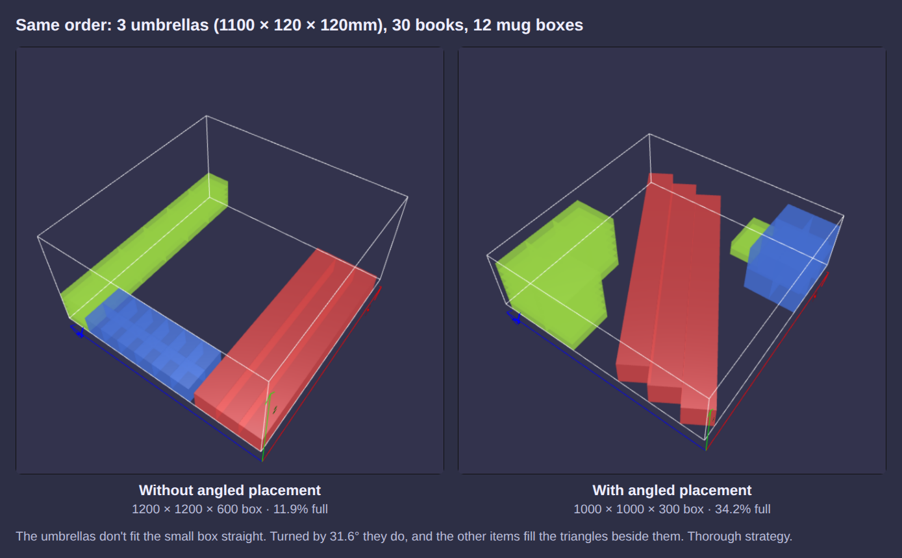
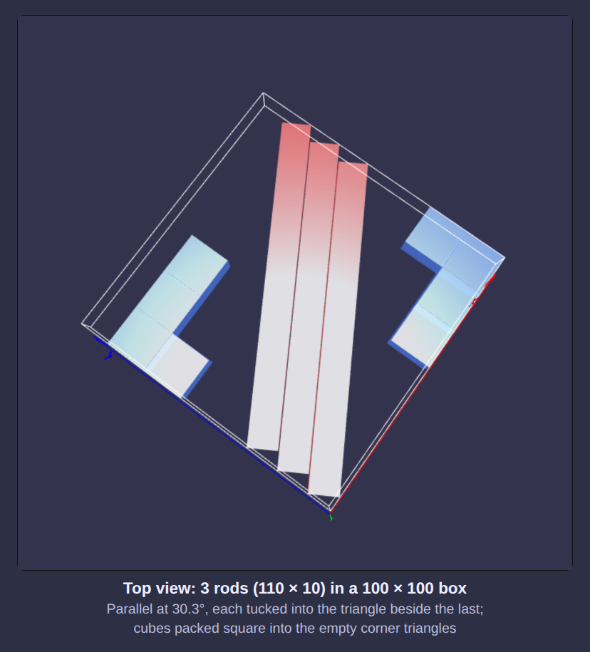

Angled placement
================

An item that is just too long for a box does not always need a bigger box: turned a little in the base of the box,
so that it runs from one side towards the opposite corner, it may well fit. An umbrella 1100mm long (and 120mm
thick) will not lie straight in a 1000 × 1000 box, but turned by 31.6° it spans exactly 1000mm and leaves room for
other items around it.

Angled placement is off by default. Turn it on with ``setAllowAngledPlacement(true)`` on the ``Packer`` (or on a
``VolumePacker``):

.. code-block:: php

    <?php
        use DVDoug\BoxPacker\Packer;
        use DVDoug\BoxPacker\PackingStrategy;
        use DVDoug\BoxPacker\Rotation;
        use DVDoug\BoxPacker\Test\TestBox;  // use your own `Box` implementation
        use DVDoug\BoxPacker\Test\TestItem; // use your own `Item` implementation

        $packer = new Packer();
        $packer->setStrategy(PackingStrategy::Thorough); // recommended, see below
        $packer->setAllowAngledPlacement(true);

        $packer->addBox(new TestBox('Small', 1000, 1000, 300, 100, 1000, 1000, 300, 10000));
        $packer->addBox(new TestBox('Large', 1200, 1200, 600, 500, 1200, 1200, 600, 10000));

        $packer->addItem(new TestItem('Umbrella', 1100, 120, 120, 400, Rotation::KeepFlat), 2);
        $packer->addItem(new TestItem('Book', 200, 150, 40, 300, Rotation::KeepFlat), 10);

        $packedBoxes = $packer->pack(); // everything goes in the small box, the umbrellas at an angle

Which items are angled
----------------------

* Only items that do not fit the box in any other way. An item that fits the box square (in any orientation its
  ``Rotation`` allows) is always packed square.
* Items are only ever turned about the vertical axis, just enough to fit: they rest on the same face as they would
  square. ``Rotation::KeepFlat`` items stay on their base, ``Rotation::BestFit`` items may first be laid on any face.
* Items with ``Rotation::Never`` are never angled, nor are items implementing ``ConstrainedPlacementItem`` (placement
  callbacks have no way of being told about an angle).

Several identical angled items are laid parallel to each other at the same angle, each tucked into the triangle left
beside the one before, so each extra item needs only a little more room. Angled items can also be stacked on top of
each other.

Turning an item leaves empty triangles in the corners of the space it takes up. These are offered to other items:
smaller items are packed into them (square to the box) and items can rest on top of angled items where they are
supported well enough (see ``setMinimumSupport()``).

Results
-------

An angled item is reported like any other ``PackedItem``, with an extra ``angle``:

* ``$packedItem->angle`` is the turn in degrees (0 for items packed square), anticlockwise from the x axis towards the
  y axis, between 0 and 90.
* ``width``, ``length`` and ``depth`` are still the item's own dimensions as packed (before turning), so its volume is
  unchanged.
* ``x``, ``y`` and ``z`` are the minimum corner of the item's bounding box, which is ``boundingWidth`` ×
  ``boundingLength`` (the same as ``width`` × ``length`` for items that are not angled). Use those rather than
  ``x + width`` to find how far an item extends when angled placement is allowed, or
  ``AngledGeometry::footprint($packedItem)`` for the four corners of its base.
* ``isAngled()`` says whether an item is angled.
* In JSON, ``angle``, ``boundingWidth`` and ``boundingLength`` are included for angled items only. The
  :ref:`visualiser<visualiser>` shows angled items as they are packed.

Strategies
----------

Angled placement works best with the :doc:`thorough strategy<thorough>`, which considers angled items alongside
everything else while it searches. With the default fast strategy, a box that can only take an item at an angle is
packed with a quick (greedy) run of the thorough strategy's block search instead, or the usual layer packer if that
packs more.

It is not available when being strict about item ordering (``beStrictAboutItemOrdering()``), which requires the
original layer packer.

On the synthetic ``overlong`` benchmark (100 e-commerce orders with items a little too long for the boxes they would
otherwise go in, ``bin/benchmark --datasets=angled --opt=angled=1``), angled placement packs every item where 22
could not be packed at all before, and uses a third less box volume with the thorough strategy (a seventh less with
the fast one) on the orders that could be packed either way.
