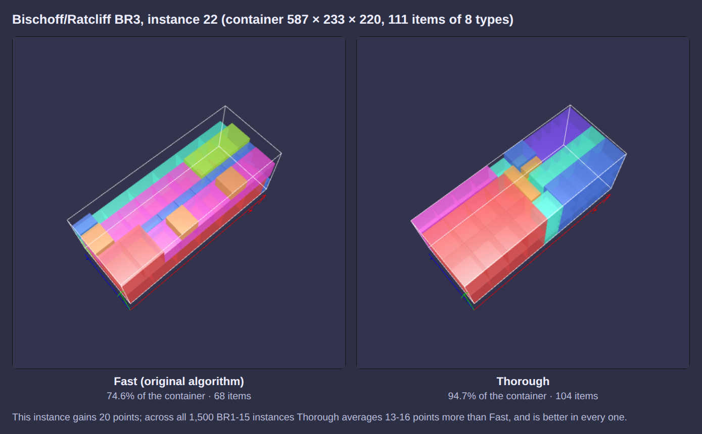

Thorough packing
================

BoxPacker has two packing strategies:

``PackingStrategy::Fast`` (the default)
    The original layer-by-layer packer described in :doc:`principles`. It is very quick, and remains the best choice
    for high-volume, low-stakes packing or for very large orders where throughput matters most.

``PackingStrategy::Thorough``
    A search-based packer that typically fills boxes considerably more densely (on the published container loading
    benchmarks, roughly 10-15 percentage points more volume than ``Fast``). It costs more CPU time, but uses a
    deterministic effort budget so run times stay bounded and results are repeatable.

.. code-block:: php

    <?php
        use DVDoug\BoxPacker\Packer;
        use DVDoug\BoxPacker\PackingStrategy;
        use DVDoug\BoxPacker\VolumePacker;

        // choosing boxes for an order
        $packer = new Packer();
        $packer->setStrategy(PackingStrategy::Thorough);
        // ... addBox() / addItem() as usual
        $packedBoxes = $packer->pack();

        // or filling one box/container
        $volumePacker = new VolumePacker($box, $items);
        $volumePacker->setStrategy(PackingStrategy::Thorough);
        $packedBox = $volumePacker->pack(); // or ->packBestSubset()

How it works
------------

Identical items are grouped into *blocks* - neat columns, walls and layers of one item type in one orientation.
The empty space in the box is tracked as a set of overlapping *maximal spaces*: the largest empty cuboids that fit
between what has been packed so far. At each step the lowest space (and of those, the one closest to a corner of the
box) is filled with the best block that fits it, the block being tucked into the corner. "Best" is the block's volume
less the part of the surrounding gap that the remaining items could never fill.

On its own that greedy procedure is already good; a *beam search* then explores alternatives. Each partial packing is
scored by greedily completing it, the most promising few are expanded further, and the search is repeated with an
ever-wider beam (1, 2, 4, 8 ...) until the effort budget or the maximum width is reached. The best complete packing
found is returned. For orders of up to 40 items the fast packer is run as well and the denser result kept, so on
those ``Thorough`` never packs less volume than ``Fast`` would (support rules permitting); on larger loads the search
is consistently the denser of the two, so only it is run.

Everything the fast packer honours is honoured: allowed rotations (``Rotation::Never``, ``KeepFlat``, ``BestFit``),
the preference for stable orientations, box weight limits, and ``ConstrainedPlacementItem`` callbacks.

Choosing the boxes
------------------

With ``Packer``, the thorough strategy first builds a solution one box at a time: if a single box can hold
everything that is left, the cheapest such box is used, otherwise the box that packs the most volume is filled. It
then searches for a better set of boxes, accepting only changes that are strictly better:

* merging two boxes into one
* emptying a box into the others, one item (or linked group) at a time
* moving each box's contents into a cheaper box type
* repacking two boxes into two cheaper ones

Moves that can only save a box stop once the number of boxes reaches a lower bound (by volume, weight, and items too
large to share a box). Box quantity limits, linked items and placement callbacks are respected throughout. Weight
redistribution (see :doc:`weight-distribution`) still runs afterwards, but its result is only kept if it does not
make the boxes more numerous or more expensive.

By default the thorough strategy minimises the number of boxes, and then their total inner volume.

Minimising cost
^^^^^^^^^^^^^^^

If what you really pay for is postage, or boxes have different prices, give the packer a ``PackedBoxCostCalculator``.
The thorough strategy then minimises the total cost of the boxes, and then their number - for example using two small
cheap boxes rather than one large expensive one when that is cheaper.

.. code-block:: php

    <?php
        use DVDoug\BoxPacker\PackedBox;
        use DVDoug\BoxPacker\PackedBoxCostCalculator;

        class ShippingCost implements PackedBoxCostCalculator
        {
            public function getCost(PackedBox $packedBox): float
            {
                $boxPrice = $packedBox->box->getPrice(); // your own Box implementation
                $postage = 3.50 + 0.002 * $packedBox->getWeight(); // e.g. per parcel plus per gram

                return $boxPrice + $postage;
            }
        }

        $packer->setCostCalculator(new ShippingCost());

The cost of a box should never go down when items are added to it (the cost of an empty box is used as a lower bound).

Support
-------

Every item packed by the thorough strategy rests on the floor of the box or on the tops of other items. By default
at least half of each item's base must be supported; you can require more (``1.0`` = no overhang at all, e.g. for
pallets) or less (``0.0`` places no requirement at all, like the fast packer):

.. code-block:: php

    <?php
        $volumePacker->setMinimumSupport(1.0);

Stricter support costs density. On the bookshop order corpus, requiring 75% support instead of 50% costs about 0.5%
more cartons; on very mixed container loads, requiring full support costs several percentage points of utilisation,
as it is much harder to build flat surfaces from items of many different heights.

Effort and run time
-------------------

Three settings control how hard the thorough strategy works:

``setSearchBudget(?int $placements)``
    The maximum number of trial block placements the search may make (default 10,000). This is a deterministic proxy
    for time - the same inputs always give the same result, whatever the machine. Small orders usually finish well
    within it; large mixed loads use all of it.

``setMaxBeamWidth(int $width)``
    The widest beam to try (default 16). Each doubling roughly quadruples the effort.

``setSearchTimeLimit(?float $seconds)``
    An optional wall-clock limit. When reached, the best packing found so far is used. Note that results then depend
    on machine speed and load.

The same settings are available on ``Packer``, where the budget applies to each box packing. There, a time limit is a
limit for the whole of ``pack()``, shared between filling the boxes and searching for better ones; the boxes are always
completed.

As a guide, with the defaults on PHP 8.4 a typical e-commerce order is packed in about 10 milliseconds; container loads
of 100-150 items of 3-20 types take around 0.1-0.6 seconds, and of 30-100 types 0.7-1.5 seconds. Large multi-box
orders of many different items take longer: several seconds for 150 different items across 4 cartons.

Things the thorough strategy does not do
----------------------------------------

``beStrictAboutItemOrdering()`` and ``packAcrossWidthOnly()`` describe a particular loading sequence, which the block
search does not follow. When either is set, the fast packer is used.
